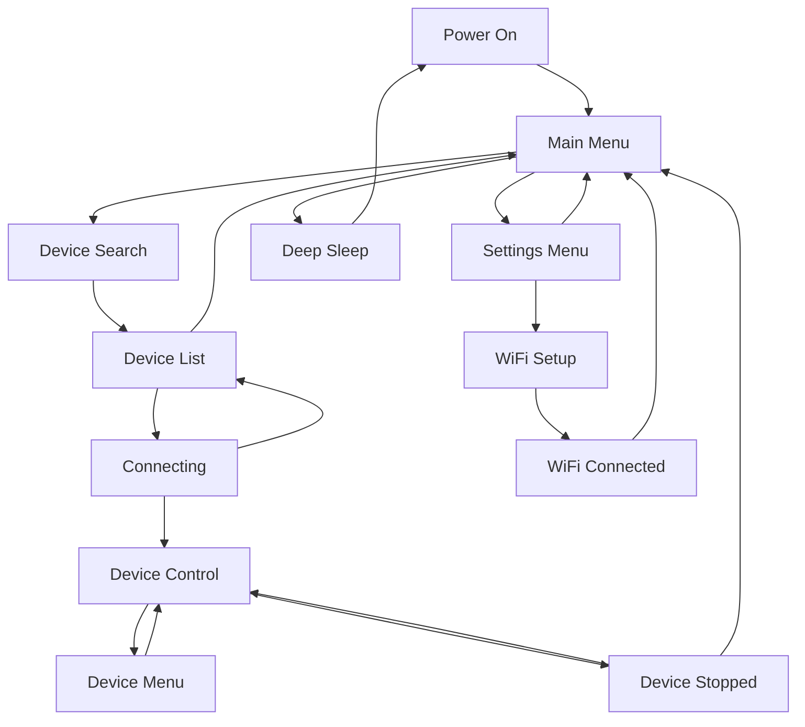

This guide covers how to navigate RADR's menus and screens using the physical controls.

## Physical Control Layout

RADR has the following physical controls:

### Top Edge
- **Left Bumper** — Located on the top-left edge, used for switching to the previous mode
- **Power Switch** — Above the screen, to the left of the USB-C port
- **Right Bumper** — Located on the top-right edge, used for switching to the next mode

### Front Face
- **320x240 Full-Color LCD** — Centered on the device
- **Three Under-Screen Buttons:**
  - **Left Button** — Home / Back
  - **Middle Button** — Pause / Stop (single press pauses, double press stops and resets)
  - **Right Button** — Menu / OK / Select

### Sides
- **Left Encoder (Knob)** — Always controls speed or primary parameter
- **Right Encoder (Knob)** — Controls secondary parameters or selection

## Main Menu

The main menu is your starting point after powering on RADR. It offers three options:

| Option | Icon | Description |
|--------|------|-------------|
| Device Search | Waves | Scan for nearby Bluetooth devices |
| Settings | Gear | Access WiFi and device settings |
| Sleep | Moon | Enter deep sleep mode to conserve battery |

### Navigation
- **Right Encoder** — Scroll through menu options
- **Right Button** — Select the highlighted option
- **Left Button** — No action (already at top level)

## Settings Menu

Access the settings menu from the main menu by selecting **Settings**.

| Option | Description |
|--------|-------------|
| Go Back | Return to the main menu |
| WiFi Settings | Configure WiFi for OTA updates |
| Update Device | Check for and install firmware updates |
| Restart Device | Reboot the RADR |

### Navigation
- **Right Encoder** — Scroll through options
- **Right Button** — Select the highlighted option
- **Left Button** — Return to main menu

## Screen States

RADR uses a state machine to manage different screens. Here's the flow:

### Device Search Screen

When you select **Device Search** from the main menu:

1. RADR scans for 5 seconds
2. Blue LEDs pulse during the scan
3. Status shows "Searching for nearby devices..."
4. After scanning, the device list appears

### Device List Screen

After scanning, you'll see a list of discovered devices:

- **Right Encoder** — Scroll through the device list
- **Right Button** — Connect to the selected device
- **Left Button** — Cancel and return to main menu

<Info>
Devices are shown by their advertised name. If a device has no name, it appears as "Unknown Device".
</Info>

### Device Connecting Screen

During connection, you'll see status messages:

1. "Initializing connection..."
2. "Creating new connection..."
3. "Connecting to [device address]..."
4. "Connected! Setting up device..."
5. "Discovering device capabilities..."
6. "Device ready!"

<Warning>
If connection fails, you'll see "Connection failed, please try again." Power-cycle both devices and retry.
</Warning>

### Device Control Screen

Once connected, you enter the device control screen. The layout varies by device type:

**For OSSM:**
- Tab interface at top showing Depth, Sensation, Stroke modes
- Left encoder dial for Speed
- Right encoder dial for the active mode
- Bottom buttons: Menu (disabled), Pause, Patterns

**For Lovense:**
- Single encoder dial for vibration intensity
- STOP button in the center

See [OSSM Controls](./ossm-controls) or [Lovense Controls](./lovense-controls) for device-specific details.

### Device Menu Screen

For devices that support patterns (like OSSM), pressing the right button opens the pattern menu:

- **Right Encoder** — Scroll through patterns
- **Right Button** — Select the highlighted pattern
- **Left Button** — Return to control screen without changing

### Device Stopped Screen

After a double-press stop, this confirmation screen appears:

- **Message:** "Your device has been stopped and reset to default play settings; but it's still connected."
- **Left Button (Back)** — Return to control screen
- **Right Button (Home)** — Return to main menu

## Button Behavior by Screen

| Screen | Left Button | Middle Button | Right Button |
|--------|------------|---------------|--------------|
| Main Menu | — | — | Select option |
| Settings Menu | Back to main | — | Select option |
| Device Search | Cancel | — | — |
| Device List | Cancel | — | Connect |
| Device Control | Menu (if enabled) | Pause/Stop | Patterns/Menu |
| Device Menu | Back to control | Pause | Select pattern |
| WiFi Setup | Cancel | — | — |

## Encoder Behavior by Screen

| Screen | Left Encoder | Right Encoder |
|--------|-------------|---------------|
| Main Menu | — | Scroll options |
| Settings Menu | — | Scroll options |
| Device List | — | Scroll devices |
| Device Control | Speed (0-100%) | Active mode (0-100%) |
| Device Menu | Speed (0-100%) | Scroll patterns |

## Tips for Navigation

<Tip>
You can access the main menu from most screens by pressing the left button repeatedly to go back.
</Tip>

<Tip>
The bumper buttons (top edge) switch between Depth, Sensation, and Stroke modes without looking at the screen. The active mode is shown in the tab interface.
</Tip>

<Warning>
RADR can only connect to one device at a time. To switch devices, disconnect the current device first by returning to the main menu.
</Warning>
